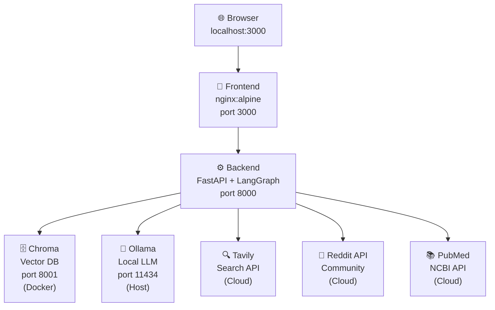
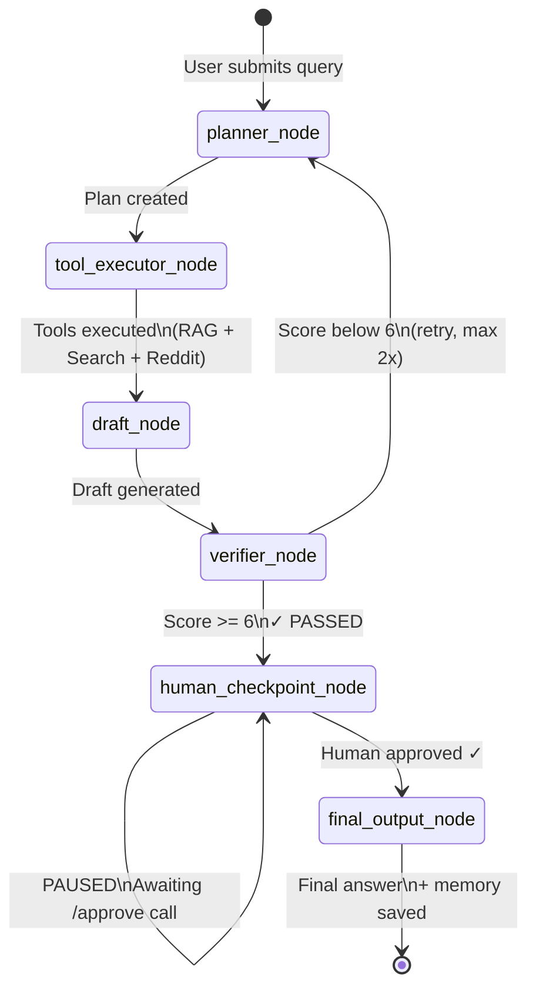
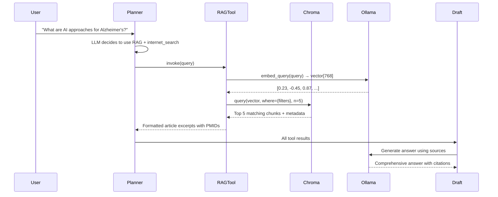

# System Architecture

## Overview

Multi-Agent Research System built with LangGraph, FastAPI, Chroma, and Ollama.
Answers complex research queries by combining PubMed RAG, internet search,
and Reddit intelligence with human-in-the-loop approval.

---

## High-Level Architecture

```
┌─────────────────────────────────────────────────────────────────┐
│                        USER BROWSER                              │
│                   http://localhost:3000                          │
│                                                                  │
│  [Query Input]  →  [Progress Bar]  →  [Trace + Draft]           │
│                                         ↓                        │
│                                    [Approve Button]              │
│                                         ↓                        │
│                                    [Final Answer]                │
└──────────────────────┬──────────────────────────────────────────┘
                       │ HTTP POST /api/v1/query
                       │ HTTP POST /api/v1/approve
                       │ HTTP GET  /api/v1/trace
                       ▼
┌─────────────────────────────────────────────────────────────────┐
│                  BACKEND SERVICE  :8000                          │
│                  FastAPI + Uvicorn                               │
│                                                                  │
│  ┌───────────────────────────────────────────────────────────┐  │
│  │              LANGGRAPH STATE MACHINE                       │  │
│  │                                                            │  │
│  │   ┌──────────┐    ┌──────────────┐    ┌───────────┐      │  │
│  │   │ PLANNER  │───▶│ TOOL         │───▶│  DRAFT    │      │  │
│  │   │          │    │ EXECUTOR     │    │ GENERATOR │      │  │
│  │   │ Decides  │    │              │    │           │      │  │
│  │   │ which    │    │ ┌──────────┐ │    │ LLM writes│      │  │
│  │   │ tools    │    │ │RAG Tool  │ │    │ answer    │      │  │
│  │   │ to use   │    │ │Search    │ │    │ from all  │      │  │
│  │   │          │    │ │Tool      │ │    │ sources   │      │  │
│  │   │ LLM      │    │ │Reddit    │ │    └─────┬─────┘      │  │
│  │   │ reasoning│    │ │Tool      │ │          │            │  │
│  │   └──────────┘    │ └──────────┘ │          ▼            │  │
│  │        ▲          └──────────────┘    ┌───────────┐      │  │
│  │        │ [retry if                    │ VERIFIER  │      │  │
│  │        │  score < 6]                  │           │      │  │
│  │        └──────────────────────────────│ LLM checks│      │  │
│  │                                       │ quality   │      │  │
│  │                                       │ score/10  │      │  │
│  │                                       └─────┬─────┘      │  │
│  │                                             │             │  │
│  │                                    [score >= 6]           │  │
│  │                                             ▼             │  │
│  │                                  ┌─────────────────────┐  │  │
│  │                                  │  HUMAN CHECKPOINT   │  │  │
│  │                                  │                     │  │  │
│  │                                  │  ◀── GRAPH PAUSES   │  │  │
│  │                                  │  State saved to     │  │  │
│  │                                  │  SQLite             │  │  │
│  │                                  │  Waits for          │  │  │
│  │                                  │  POST /approve      │  │  │
│  │                                  └──────────┬──────────┘  │  │
│  │                                             │             │  │
│  │                                    [human approved]       │  │
│  │                                             ▼             │  │
│  │                                  ┌─────────────────────┐  │  │
│  │                                  │  FINAL OUTPUT       │  │  │
│  │                                  │  Format + Citations  │  │  │
│  │                                  │  Save to memory     │  │  │
│  │                                  └─────────────────────┘  │  │
│  └───────────────────────────────────────────────────────────┘  │
│                                                                  │
│  ┌─────────────────────────────────────────────────────────┐    │
│  │                    MEMORY LAYER                          │    │
│  │                                                          │    │
│  │  Short-term: GraphState (in-memory during session)       │    │
│  │  Long-term:  SQLite (memory_store.db, persists forever)  │    │
│  │  Checkpoint: SQLite (graph_checkpoints.db, for resume)   │    │
│  └─────────────────────────────────────────────────────────┘    │
└──────────────────┬────────────────────┬────────────────────────-┘
                   │                    │
         ┌─────────▼──────┐   ┌────────▼────────┐
         │  CHROMA :8001  │   │  OLLAMA :11434  │
         │  (Docker)      │   │  (Local)        │
         │                │   │                 │
         │  434+ document │   │  llama3:latest  │
         │  chunks from   │   │  mistral:latest │
         │  PubMed        │   │  qwen3:1.7b     │
         │                │   │  nomic-embed-   │
         │  Vector DB for │   │  text           │
         │  RAG retrieval │   │                 │
         └────────────────┘   └─────────────────┘
                   │
         ┌─────────▼─────────────────────────────┐
         │           EXTERNAL APIs               │
         │                                       │
         │  Tavily Search API (internet search)  │
         │  PubMed / NCBI E-utilities (ingestion)│
         │  Reddit API (community intelligence)  │
         └───────────────────────────────────────┘
```

---

## Service Map (Docker Compose)



---

## LangGraph State Machine



---

## Data Flow: RAG Pipeline



---

## Folder Structure

```
multi-agent-system/
│
├── docker-compose.yml          # Orchestrates all services
├── .env                        # Real secrets (not in Git)
├── .env.example                # Template (in Git)
├── README.md                   # Setup and usage guide
│
├── docs/
│   ├── architecture.md         # This file
│   └── design.md               # Design decisions
│
├── backend/                    # FastAPI + LangGraph
│   ├── main.py                 # FastAPI app + startup
│   ├── config.py               # Model-agnostic config
│   ├── requirements.txt        # Python dependencies
│   ├── Dockerfile              # Backend container
│   │
│   ├── graph/                  # LangGraph orchestration
│   │   ├── state.py            # GraphState TypedDict
│   │   ├── nodes.py            # 6 node functions
│   │   ├── edges.py            # Routing/conditional logic
│   │   └── graph.py            # Graph assembly + compile
│   │
│   ├── tools/                  # Tool adapters
│   │   ├── retrieval_tool.py   # Chroma hybrid RAG tool
│   │   ├── search_tool.py      # Tavily internet search
│   │   └── reddit_tool.py      # Reddit PRAW tool
│   │
│   ├── agents/                 # Agent configurations
│   ├── memory/                 # Memory management
│   │   ├── short_term.py       # GraphState utilities
│   │   └── long_term.py        # SQLite persistence
│   │
│   └── api/
│       └── routes.py           # /query /approve /trace
│
├── frontend/                   # HTML + JavaScript UI
│   ├── index.html              # Complete single-file UI
│   └── Dockerfile              # nginx container
│
├── scripts/
│   └── ingest_pubmed.py        # Knowledge base ingestion
│
└── chroma_data/                # Chroma vector DB data
``` 